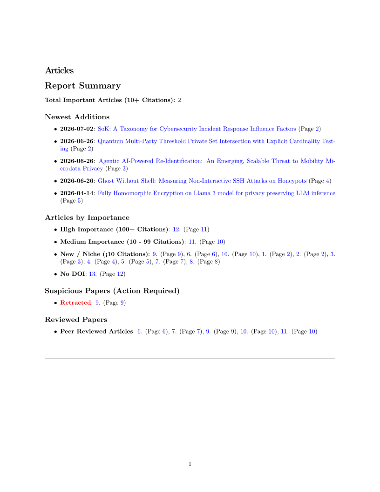
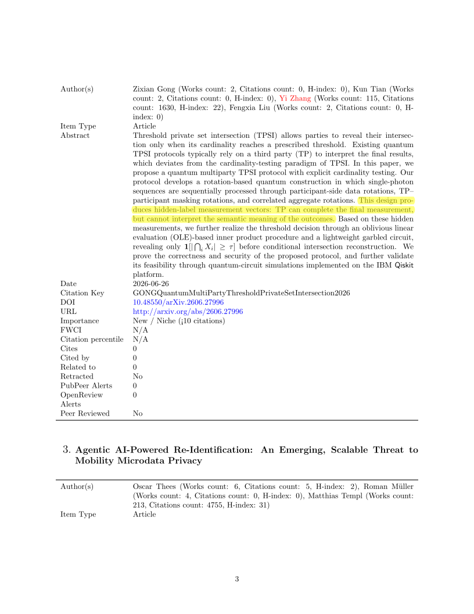
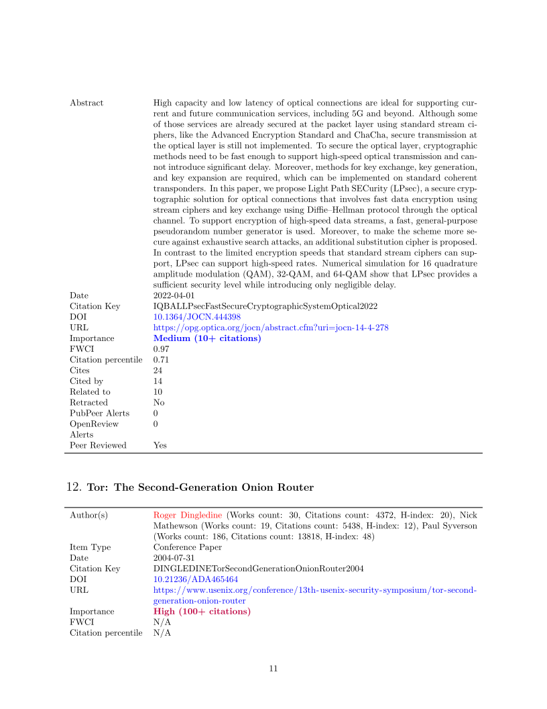

# litresearch

```
 _      _ _   _____                               _
| |    (_) | |  __ \                             | |
| |     _| |_| |__) |___  ___  ___  __ _ _ __ ___| |__
| |    | | __|  _  // _ \/ __|/ _ \/ _` | '__/ __| '_ \
| |____| | |_| | \ \  __/\__ \  __/ (_| | | | (__| | | |
|______|_|\__|_|  \_\___||___/\___|\__,_|_|  \___|_| |_|

```

Academic literature piles up in a surprising number of ways when you're writing a thesis. A PDF here, a citation there. Before you know it, you have a mountain of bibliography files, half of which are retracted or written by authors who aren't even active in the field anymore. None of it looks like a big deal when you download them one by one. But stack up fifty papers, and suddenly you have no idea what you're actually looking at.

This project is a command-line tool that tries to solve that. You feed it a bibliography export (either CSL-JSON `.json` or BibTeX `.bib`) from Zotero or any other citation manager, and it queries external databases — OpenAlex, PubPeer, and OpenReview — to figure out citation counts, find potential retractions, check if any author is in the top 2% globally, and compile it all into a LaTeX PDF digest. Essentially, it says, *"Here are the papers you grabbed, here's what the academic community actually thinks of them, and here's who you should read first."*

It's a literature auditing tool. The idea is to run it on your library, see which papers are solid, and structure your references before writing your actual thesis draft. It is an enrichment pipeline, and it'll tell you so — repeatedly, in the limitations section — because I'd rather you read the papers than be impressed by a compiled summary.

I did it because of my BSc thesis. This enriches the mess automatically.

## data

The application relies on a sample bibliography export in either BibTeX (`bibliography.bib`) or CSL-JSON (`bibliography.json`) format and a massive Excel spreadsheet (`top_scientists_database.xlsx`) containing the top 2% most-cited scientists in the world. Since the `.xlsx` file is too large for GitHub, you'll need to download it separately and place it in the project root.

The one-line version of the premise: a paper that looks amazing in your downloads folder might actually have a retraction warning or a low citation impact when cross-referenced. Low context alone, high clarity together. That's the whole idea.

## what it actually produces

Formally: a user gives it a bibliography export and the top scientists database, and it gives you back a compiled LaTeX PDF containing:

- publication-relevant metadata pulled from OpenAlex (like citations, open access status, and normalized impact)
- feedback markers from PubPeer that flag if a paper has comments or public concerns
- review details from OpenReview to show how the paper fared in peer review
- highlighted names for any author who actually matches the top 2% scientist database
- **native PDF highlight persistence** that intelligently preserves and re-applies user highlight annotations across document regenerations



## user model

Worth being clear about who the imagined users are, because it shapes everything:

- **what researchers can do:** run automated checks on citation counts, find retractions, flag top authors, and preserve PDF text highlights across report builds without visiting dozens of websites
- **what supervisors get:** a clean, formatted LaTeX PDF summary that cuts straight to the high-impact papers and filters out the fluff
- **what you're trying to win:** time. stop reading papers that have been debunked or ignored by the community

So it's a researcher, working from a terminal, trying to filter a bibliography — no wasting time on low-quality work. The pipeline exists because that's the realistic flow for literature reviews.

## how the pipeline actually goes

Mental model first, bullets second. When you feed the tool your bibliography, here's the journey the data takes:

**1. it parses the bibliography export**

- The backend parses the bibliography JSON (`bibliography.json`) or BibTeX (`bibliography.bib`).
- It maps the records into a structured HTML template, normalizing author names and titles to build a baseline list.

**2. it queries academic apis**

- The code reads the HTML report and checks papers against external APIs.
- It hits OpenAlex for citations and Open Access details, PubPeer for retraction signals or public comments, and OpenReview for review decisions.

**3. it runs the author lookup**

- It scans the massive `top_scientists_database.xlsx` using a low-memory streaming XML reader (`iterparse`).
- It flags any matches where a paper author is in the top 2% career-citation database.

**4. it checks and extracts existing pdf highlights**

- Before `pdflatex` compilation, it checks if an existing PDF contains native highlight annotations.
- It extracts highlighted text using precise word center-point filtering (`(x_center, y_center)`), ensuring exact text boundaries without capturing surrounding margins or words.

**5. it compiles the latex report and re-applies highlights**

- The collected metrics and matches are injected into `report_template.tex` and `paper_item_template.tex`.
- It runs `pdflatex` to output a compiled PDF digest.
- If highlights were detected in previous versions, it re-anchors and re-applies them to the newly generated PDF as native annotation objects via quad geometry (`fitz.Quad`).

## pdf highlight persistence

When reviewing generated PDF summaries, you can highlight important text directly in your PDF viewer. The `litresearch` pipeline intelligently handles these annotations:

- Highlights are applied exclusively to the final PDF file as native PDF annotation objects. Source HTML and LaTeX markup remain 100% clean
- Uses `PyMuPDF` (`fitz`) quad polygon geometry (`fitz.Quad`) to re-anchor highlights onto newly compiled documents with exact line alignment
- Highlight annotations deleted in your PDF reader are automatically updated in `.pdf_highlights_cache.json`, preventing deleted highlights



## what you get out the other end

- A clean, compiled LaTeX PDF report showing all paper metrics, highlighted authors, and preserved PDF highlight annotations
- A parsed bibliography HTML file that serves as an intermediate report
- A cached names list file (`xlsx_names_cache.txt`) that speeds up subsequent author lookups



## directory structure

Here is how the project files are laid out:

| folder/file | what it does |
|-------------|--------------|
| `assets/` | contains preview screenshots and figures for the documentation |
| `main.py` | the command-line entry point |
| `paper_analyzer.py` | core module for querying apis, looking up authors, and compiling latex |
| `zotero_report_generator.py` | parses JSON or BibTeX bibliography files and turns them into html reports |
| `top_scientists_database.xlsx` | the massive author database (~89mb, must download separately due to github size limits) |
| `bibliography.json` | a sample json bibliography export to test the tool |
| `bibliography.bib` | a sample BibTeX bibliography export to test the tool |
| `report_template.tex` | the main latex template used to render the final pdf |
| `paper_item_template.tex` | the snippet template for individual paper entries in the report |
| `pyproject.toml` | package metadata and dependencies for uv |
| `requirements.txt` | regular pip dependency specification |

## installation

It's set up to work with **`uv`**, the python package installer:

```bash
# install it as a global tool
uv tool install .
```

That's it for the tool itself. If you want to compile the LaTeX reports to PDF, you will also need `pdflatex` installed on your system. Note that the `top_scientists_database.xlsx` file is too large to host on GitHub; you'll need to download it separately and place it directly in the project root.

## how to run it

You can run the entire pipeline (parsing, api lookups, excel search, and compiling the pdf) in a single command using either a BibTeX (`.bib`) file or a CSL-JSON (`.json`) file:

```bash
# run the full pipeline using a BibTeX file
litresearch run --bib bibliography.bib --clean

# run the full pipeline using a JSON file
litresearch run --json bibliography.json --clean
```

If you don't want to run the whole pipeline in one go, you can run the individual steps manually:

**1. generate the intermediate html report**

```bash
# using a BibTeX file
litresearch generate --bib bibliography.bib --html bibliography.html

# using a JSON file
litresearch generate --json bibliography.json --html bibliography.html
```

**2. analyze the report and compile the pdf**

```bash
litresearch analyze --html bibliography.html --tex bibliography.tex
```

## external apis and lookups

The tool does some heavy lifting behind the scenes to gather metrics:

- **openalex:** queried via DOIs to fetch citation counts, open access status, and normalized citation impact.
- **pubpeer:** hits the chrome extension endpoint to search for retractions, correction notes, or comment threads.
- **openreview:** normalizes titles and author lists to look up peer reviews, decisions, and overall notes.
- **the top 2% database:** parses the 89mb excel sheet without burning your computer's memory. It uses a streaming xml parser (`iterparse`) to check names in about 2 seconds once cached.

## limitations

This is an enrichment tool, not a replacement for actually reading papers. *Please do not base your entire literature review on whether an author's name is highlighted in red.*

- **author matches are naive.** the name matching is a simple text search. If your paper was written by a "John Smith", the tool will probably highlight him as a top 2% global scientist, whether he is or not.
- **api goodwill is limited.** if you run it on a massive bibliography with hundreds of papers (>>400), openalex or openreview might rate-limit or block you. keep it reasonable.
- **pdflatex is required.** if you don't have a working LaTeX installation that the CLI can call via `pdflatex`, the process will fail at the very end, leaving you with raw tex files but no pdf.
    - however, you can use `https://www.overleaf.com/` with the produced `bibliography.tex`  
- **caching dependency.** the first run builds a cache of names from the excel sheet. If you modify the excel file, make sure to delete `xlsx_names_cache.txt` so it regenerates properly.
